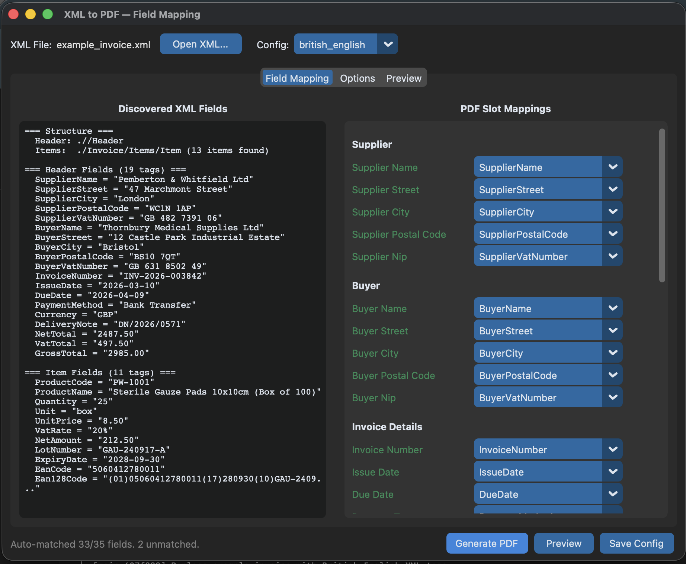
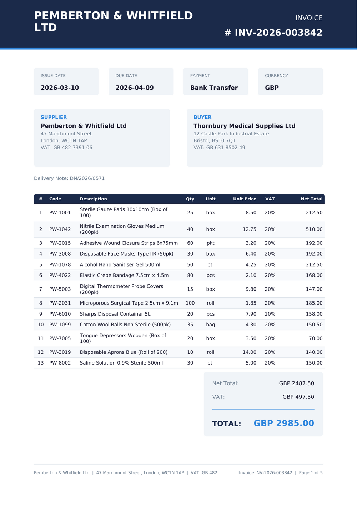
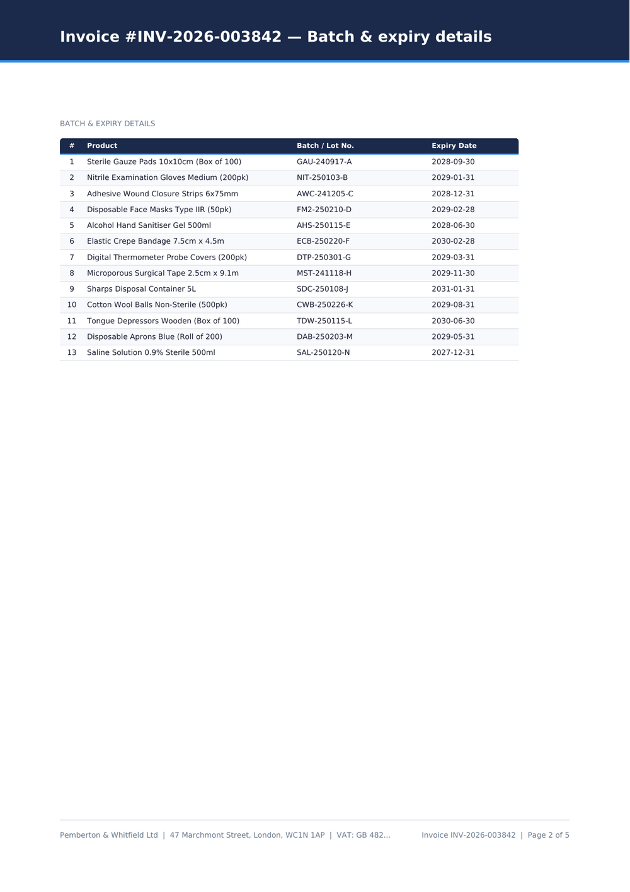
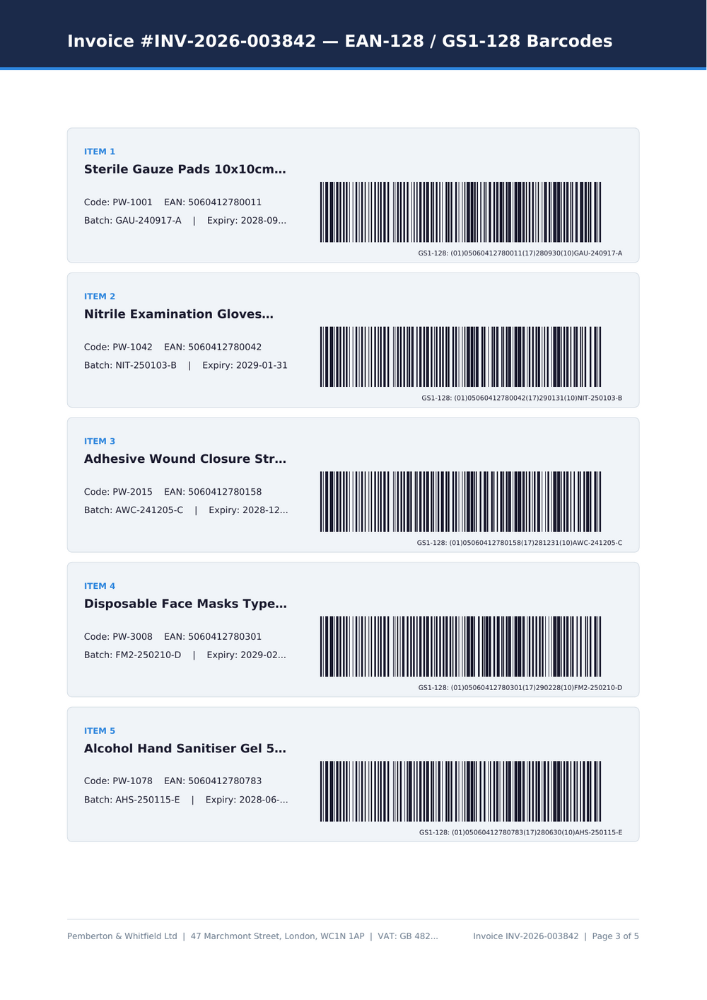

# XML to PDF Invoice Converter

A Python tool for exporting XML invoice files to professionally formatted PDF documents.

[](CHANGELOG.md)

## Features

- Converts XML invoice data into clean, multi-page PDF reports
- Items and batch tables automatically paginate across pages with repeated headers
- Conformant EAN-128 / GS1-128 barcode pages for each invoice item (FNC1-prefixed
  AI data, with the parenthesised human-readable form printed below the symbol)
- Configurable field mapping — supports different XML schemas via JSON config files
- Namespaced documents (a default `xmlns` on the root, as UBL uses) are supported
- Tolerant amount parsing: `1,50`, `1 234,56`, `1.234,56` and `1,234.56` all work
- GUI mode (CustomTkinter) for visual field mapping and one-click PDF generation
- CLI mode for single-file or batch conversion

## Download

Ready-to-run executables are attached to every
[release](https://github.com/AmigoUK/xml-to-pdf/releases) — no Python, no
dependencies, no font installation:

| Platform | Asset |
|---|---|
| Windows (x64) | `xml-to-pdf-windows-x64.exe` |
| macOS (Apple silicon) | `xml-to-pdf-macos-arm64.tar.gz` |
| macOS (Intel, x86_64) | **no binary** — [run from source](#intel-macs-run-from-source) |
| Linux (x64) | `xml-to-pdf-linux-x64.tar.gz` |

DejaVu Sans and all seven language profiles travel inside the executable. Run
it with no arguments for the GUI, or with a file for the CLI:

```
xml-to-pdf-windows-x64.exe invoice.xml
xml-to-pdf-windows-x64.exe invoice.xml --config polish
```

The Unix builds are tarballs because a release asset carries no POSIX
permissions — a bare download arrives without its executable bit, while a
tarball keeps it, so there is no `chmod` step:

```bash
tar -xzf xml-to-pdf-linux-x64.tar.gz
./xml-to-pdf invoice.xml
```

Unix executables carry no filename extension by design: the executable bit and
the file header identify a program, not its name. `.exe` is a Windows
convention.

### Intel Macs: run from source

**There is no Intel (x86_64) macOS binary.** GitHub is retiring its x86_64
macOS runners and the best-effort build job has never been scheduled, so no
release carries one. An Intel Mac cannot run the Apple-silicon binary either —
Rosetta translates Intel code to run on Apple silicon, not the other way round.

Running from source works fully, GUI included. It takes about a minute:

```bash
# 1. Python 3.12 with Tk. macOS ships neither a recent Python nor tkinter.
brew install python@3.12 python-tk@3.12
#    (or use the installer from python.org, which bundles Tcl/Tk already)

# 2. The code
git clone https://github.com/AmigoUK/xml-to-pdf.git
cd xml-to-pdf

# 3. Dependencies, in a virtualenv
python3.12 -m venv .venv
source .venv/bin/activate
pip install -r requirements.txt

# 4. Fonts. macOS has no DejaVu Sans, which the renderer needs.
python scripts/fetch_fonts.py fonts

# 5. Run it
python xml_invoice_to_pdf.py invoice.xml                  # CLI
python xml_invoice_to_pdf.py invoice.xml --config polish  # with a profile
python xml_invoice_to_pdf.py                              # GUI
```

Two conveniences worth knowing:

- Fonts fetched into `fonts/` are found automatically — no `--font-dir` needed.
- Once `.venv` exists in the project directory the tool re-executes itself with
  it, so later runs work without `source .venv/bin/activate`.

Everything the binaries do, the source does: the same seven language profiles,
the same GS1-128 barcodes, the same GUI. The only thing you give up is not
having to install Python.

Apple-silicon Macs can use either the binary or these same steps.

Profiles can be named rather than pathed (`--config polish`). Dropping your own
`configs/*.json` or `DejaVuSans*.ttf` next to the executable overrides the
bundled ones.

### Verifying a download

Every binary is built by GitHub Actions from a tagged commit and carries a
[Sigstore](https://www.sigstore.dev/) provenance attestation, so you can check
it really came from this repository rather than trusting the file blindly:

```bash
gh attestation verify xml-to-pdf-windows-x64.exe --repo AmigoUK/xml-to-pdf
```

That subcommand needs GitHub CLI 2.49 or newer. On an older `gh`, ask the API
for the attestation covering the file's digest instead:

```bash
gh api "repos/AmigoUK/xml-to-pdf/attestations/sha256:$(sha256sum -z \
  xml-to-pdf-windows-x64.exe | cut -d' ' -f1)"
```

The `builder.id` in the returned SLSA statement names the repository, workflow
and tag the binary was built from.

`SHA256SUMS.txt` is attached to the release as well:

```bash
sha256sum -c SHA256SUMS.txt --ignore-missing
```

### The "unknown publisher" warning

The binaries are **not** code-signed, so Windows SmartScreen and macOS
Gatekeeper will warn on first run. That is expected, and it cannot be removed
for free: SmartScreen works on publisher reputation (a self-signed certificate
buys nothing; an OV/EV certificate costs a few hundred a year) and Gatekeeper
requires a notarised Apple Developer ID. Verify the attestation above, then:

- **Windows** — "More info" → "Run anyway".
- **macOS** — right-click → "Open", or clear the quarantine flag on that one
  file: `xattr -d com.apple.quarantine xml-to-pdf`.

Do not turn SmartScreen or Gatekeeper off; the per-file confirmation is all
that is needed.

## Installation

```bash
pip install -r requirements.txt
```

DejaVu Sans is required for full Unicode (including Polish) support. Only
`DejaVuSans.ttf` and `DejaVuSans-Bold.ttf` are needed — the italic faces are
used if present but never required. On Debian/Ubuntu:

```bash
sudo apt install fonts-dejavu-core
```

Otherwise place the `.ttf` files in the project directory, or point `--font-dir`
at them.

## Usage

### CLI

```bash
# Convert a single invoice
python xml_invoice_to_pdf.py invoice.xml

# Specify output path
python xml_invoice_to_pdf.py invoice.xml -o output.pdf

# Batch convert multiple files
python xml_invoice_to_pdf.py *.xml

# Skip barcode pages
python xml_invoice_to_pdf.py invoice.xml --no-barcodes

# Use a custom field mapping config
python xml_invoice_to_pdf.py invoice.xml --config configs/polish.json

# Show the version
python xml_invoice_to_pdf.py --version
```

`--no-barcodes` overrides whatever the config says; without it, the config's own
`include_barcodes` setting is respected.

### GUI

```bash
python xml_invoice_to_pdf.py --gui
```

## Screenshots

### GUI — Field Mapping
Load an XML invoice and visually map XML tags to PDF slots. The auto-matcher detects fields across multiple languages. Unmatched fields can be assigned manually via dropdowns.



### PDF Preview — Invoice Page
Live preview of the generated PDF with supplier/buyer details, date badges, paginated items table, and totals summary.



### Batch & Expiry Details
Continuation page showing the batch/lot numbers and expiry dates table with a navy header bar indicating the section.



### EAN-128 / GS1-128 Barcodes
Barcode pages with product details and scannable GS1-128 codes for each invoice item.



## Supported Languages

Pre-built configs are included in `configs/`:

| Config | Language | Example XML tags |
|---|---|---|
| `british_english.json` | English (default) | `SupplierName`, `InvoiceNumber`, `ProductCode` |
| `polish.json` | Polish | `DostawcaNazwa`, `FakturaNumer`, `TowarKod` |
| `german.json` | German | `LieferantName`, `Rechnungsnummer`, `ArtikelNr` |
| `french.json` | French | `FournisseurNom`, `NumeroFacture`, `CodeArticle` |
| `spanish.json` | Spanish | `ProveedorNombre`, `NumeroFactura`, `CodigoProducto` |
| `italian.json` | Italian | `FornitoreNome`, `NumeroFattura`, `CodiceProdotto` |
| `dutch.json` | Dutch | `LeverancierNaam`, `Factuurnummer`, `ArtikelCode` |

## Adding Your Own Language

To support a new XML schema or language, create a JSON config file in `configs/`. Use any existing config as a starting point:

1. **Copy a template** — duplicate `configs/british_english.json` and rename it (e.g. `configs/portuguese.json`).

2. **Set the name** — change `"name"` to identify your config.

3. **Set XPath expressions** — these tell the parser where to find data in your XML:
   - `"header_xpath"` — path to the element containing invoice header fields (supplier, buyer, dates, totals)
   - `"item_xpath"` — path to each repeating line item element

   For example, if your XML looks like:
   ```xml
   <Documento>
     <Cabecalho>
       <NomeFornecedor>...</NomeFornecedor>
     </Cabecalho>
     <Itens>
       <Item>...</Item>
     </Itens>
   </Documento>
   ```
   Then set:
   ```json
   "header_xpath": ".//Cabecalho",
   "item_xpath": ".//Item"
   ```

4. **Map each field** — in `"mappings"`, set the value for each slot to the XML tag name used in your invoice. The left side (slot) is fixed, the right side (XML tag) is what you change:

   ```json
   {
     "name": "portuguese",
     "mappings": {
       "supplier_name": "NomeFornecedor",
       "supplier_street": "RuaFornecedor",
       "supplier_city": "CidadeFornecedor",
       "supplier_postal_code": "CodigoPostalFornecedor",
       "supplier_nip": "NIFFornecedor",
       "buyer_name": "NomeComprador",
       "buyer_street": "RuaComprador",
       "buyer_city": "CidadeComprador",
       "buyer_postal_code": "CodigoPostalComprador",
       "buyer_nip": "NIFComprador",
       "invoice_number": "NumeroFatura",
       "issue_date": "DataEmissao",
       "due_date": "DataVencimento",
       "payment_type": "MetodoPagamento",
       "currency": "Moeda",
       "delivery_note": "GuiaRemessa",
       "net_total": "TotalLiquido",
       "vat_total": "TotalIVA",
       "gross_total": "TotalBruto",
       "item_code": "CodigoProduto",
       "item_name": "NomeProduto",
       "item_qty": "Quantidade",
       "item_unit": "Unidade",
       "item_unit_price": "PrecoUnitario",
       "item_vat_rate": "TaxaIVA",
       "item_net_total": "ValorLiquido",
       "batch_product_name": "NomeProduto",
       "batch_lot_number": "NumeroLote",
       "batch_expiry_date": "DataValidade",
       "barcode_ean128": "CodigoEan128",
       "barcode_ean": "CodigoEan",
       "barcode_product_name": "NomeProduto",
       "barcode_product_code": "CodigoProduto",
       "barcode_batch": "NumeroLote",
       "barcode_expiry": "DataValidade"
     },
     "include_barcodes": true,
     "font_dir": null,
     "header_xpath": ".//Cabecalho",
     "item_xpath": ".//Item"
   }
   ```

5. **Use your config**:
   ```bash
   python xml_invoice_to_pdf.py invoice.xml --config configs/portuguese.json
   ```

### Available mapping slots

| Slot | Description |
|---|---|
| **Supplier** | |
| `supplier_name` | Company name |
| `supplier_street` | Street address |
| `supplier_city` | City |
| `supplier_postal_code` | Postal / ZIP code |
| `supplier_nip` | VAT / tax ID number |
| **Buyer** | |
| `buyer_name` | Company name |
| `buyer_street` | Street address |
| `buyer_city` | City |
| `buyer_postal_code` | Postal / ZIP code |
| `buyer_nip` | VAT / tax ID number |
| **Invoice details** | |
| `invoice_number` | Invoice reference number |
| `issue_date` | Date of issue |
| `due_date` | Payment due date |
| `payment_type` | Payment method |
| `currency` | Currency code (GBP, EUR, etc.) |
| `delivery_note` | Delivery note reference |
| **Totals** | |
| `net_total` | Total excluding VAT |
| `vat_total` | Total VAT amount |
| `gross_total` | Total including VAT |
| **Items table** | |
| `item_code` | Product / SKU code |
| `item_name` | Product description |
| `item_qty` | Quantity |
| `item_unit` | Unit of measure |
| `item_unit_price` | Price per unit (net) |
| `item_vat_rate` | VAT rate percentage |
| `item_net_total` | Line total (net) |
| **Batch details** | |
| `batch_product_name` | Product name (batch table) |
| `batch_lot_number` | Batch / lot number |
| `batch_expiry_date` | Expiry / best-before date |
| **Barcodes** | |
| `barcode_ean128` | EAN-128 / GS1-128 barcode string |
| `barcode_ean` | EAN-13 / GTIN code |
| `barcode_product_name` | Product name (barcode card) |
| `barcode_product_code` | Product code (barcode card) |
| `barcode_batch` | Batch number (barcode card) |
| `barcode_expiry` | Expiry date (barcode card) |

Any slot left out of the mappings will simply be blank on the PDF.

## Project Structure

```
xml_invoice_to_pdf.py  — CLI entry point
pdf_renderer.py        — PDF drawing, pagination, amount parsing, GS1-128 encoding
xml_parser.py          — XML invoice parsing and field discovery
mapping.py             — Field mapping configuration and auto-matching
gui.py                 — CustomTkinter GUI
preview.py             — PDF preview helper
__about__.py           — Version constant
paths.py               — Font/config lookup, from source or a frozen bundle
configs/               — Saved mapping profiles (one per language)
tests/                 — pytest suite
example_invoice.xml    — Sample British English invoice
screenshots/          — README screenshots
requirements.txt       — Runtime dependencies
requirements-dev.txt   — Test dependencies
CHANGELOG.md           — Release history
xml-to-pdf.spec        — PyInstaller build spec
scripts/fetch_fonts.py — Downloads DejaVu Sans for a bundled build
.github/workflows/     — Tests, and per-platform release binaries
```

## Building an executable yourself

```bash
pip install pyinstaller
python scripts/fetch_fonts.py fonts
pyinstaller --clean --noconfirm xml-to-pdf.spec   # -> dist/xml-to-pdf
```

PyInstaller does not cross-compile: a Windows `.exe` has to be built on
Windows. That is what the release workflow does — pushing a `vX.Y.Z` tag runs
the test suite, then builds and attaches all three binaries.

## Tests

```bash
pip install -r requirements-dev.txt
python -m pytest tests/
```

The suite checks the generated PDFs rather than just the code paths: word
bounding boxes are read back with `pdftotext -bbox` to prove nothing overflows
a box or the footer, and the barcode pages are rendered at 300 dpi and decoded
with `zbarimg` to prove the symbols are real GS1-128. Both tools are optional —
the affected tests skip when they are missing:

```bash
sudo apt install poppler-utils zbar-tools
```
